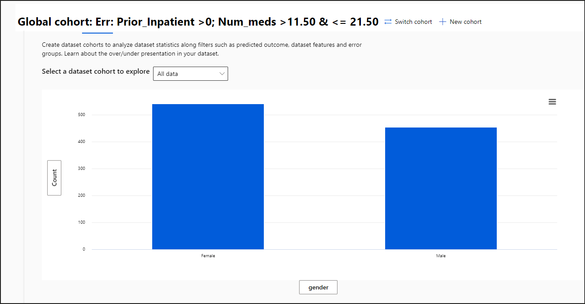
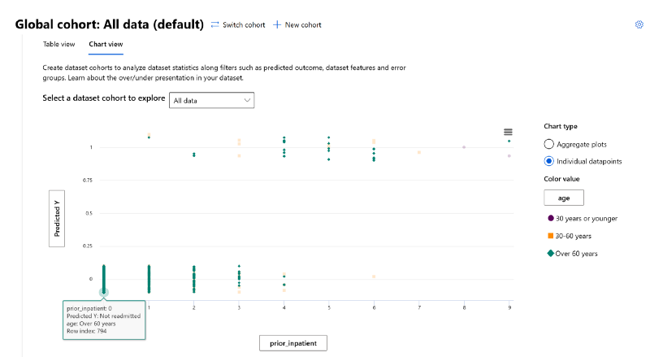

# **Lab 10 - Perform Data Analysis using Responsible AI dashboard**

Lab Type – Instructor led

Expected Duration – 30 minutes

**Objective**

In this lab, we will explore how to use the Data Analysis section of the
Azure Responsible AI (RAI) dashboard to discover the root-cause of the
model’s performance due to problematic data distribution.

## **Exercise 1: Data Analysis: Table view**

Continue with the Responsible AI dashboard from the last lab.

The Table view helps in visualizing all the features and rows of the
data in a selected cohort. Since we want to analyze the data for when
the model is performing poorly, switch the cohort for "All data"
to **Err: Prior_Inpatient \>0; Num_meds \>11.50 & \<= 21.50**.

1.  Click on the **switch cohort** link on top of the dashboard.

    

2.  Then select the **Err: Prior_Inpatient \>0; Num_meds \>11.50 & \<=
    21.50** cohort under the **Cohort list** drop-down menu list and
    click on **Apply**.

    

3.  Review the individual patient records under the **Correct
    predictions** or **Incorrect predictions**.

    

## **Exercise 2: Data Analysis chart view**

The chart view of the dashboard is another useful tool to visualize the
data representation. You will be using the chart to compare the data
distribution for the patients data.

### **Task 1: Check data imbalance issues**

1.  Select the **Chart view** pane. Use the cohort with all the test
    data by selecting the **All data** option from the **Select a
    dataset cohort to explore** drop-down menu.

    

2.  On the Y-axis, click on the current selected **race** button, which
    will launch a pop-up menu. Under **Select your axis value**, choose
    **Count**.

    

3.  On the X-axis, click on the current selected **Index** value, then
    choose **True Y** under the **Select your axis value** menu.

    

4.  You can see that the data distribution between both classes is
    **imbalanced**.

    

5.  Looks like out of the **994** diabetes patients test
    data, **798** patients are Not readmitted and 198 are Readmitted.
    These are the actual values or TrueY.

6.  On the X-axis, click on the current selected **Index** value, then
    choose **Predicted Y** under the **Select your axis value** menu.

7.  You can see that the model’s number of patients Readmitted
    is **41**, while the number of patients Not Readmitted is **953**.
    So, this definitely exposes an extreme data imbalance issue where
    the model is not performing well for cases where patients are
    Readmitted.

    

### **Task 2: Check sensitive data representation**

It is important to check for data disparities for non-sensitive and
sensitive data (e.g., *age*, *gender*, *race* etc.).

1.  On the Y-axis, verify that **Count** is still selected.

2.  On the X-axis, click on the current selected **Predicted Y** button,
    which will launch a pop-up menu. Under **Select your axis value**,
    click on the **Dataset** radio button.

    

4.  You will find that, there's a lot of disparities among **Race**
    representation.

5.  Caucasians represent 77% of patients in the test data.
    African-Americans make up 19% of the patients. Hispanics represent
    2% of the data. There's obviously a lot of gaps between the
    different races.

6.  This is an area that will be a good candidate for a data scientist
    or ML engineer to flagged to make sure it does not induce any racial
    biases.

    

7.  Next, on the X-axis, click on the current selected **race** button,
    which will launch a pop-up menu. Under **Select your axis value**,
    click on the **Dataset** radio button. Under the **Select feature**
    drop-down menu, select **gender**.

    

7.  The gender representation among the patient is fairly balanced. So,
    this is not an area of concern.

    

8.  Finally, On the X-axis, replace gender to age.

9.  The **Age** representation is not proportionately distributed across
    the 3 age groups. Diabetes tends to affect individuals the older
    they get.

10. This may be an acceptable and expected disparity, however this is
    another candidate for a data scientist to validate with medical
    specialists.

    

### **Task 3: Check Hospital Readmissions**

Let’s see what impact the **Prior_Inpatient** has to the model’s
outcome.

1.  Click on the y-axis label. In the pop-up window pane, select the
    **Dataset** radio button. Then under **select feature**,
    select **prior_inpatient** on the drop-down menu.

    

2.  On the X-axis, click on the current selected **Index(Age)** value,
    then choose **Predicted Y** under the **Select your axis value**
    menu.

    

3.  As you can see, the chart shows that the more the number of
    inpatients hospital stays a diabetic patient has in the past, the
    more likely they will be readmitted back in the hospital in 30 days.
    Patients with less prior inpatients are more likely not to be
    readmitted.

    

4.  Click on the y-axis label. In the pop-up window pane, select the
    **Dataset** radio button. Then under **select feature**,
    select **race** on the drop-down menu.

    

5.  Leave the X-axis to be **Predicted Y**.

    

6.  For **Race**, the chart shows that due to the data imbalance, the
    model will not be able to predict if a patient will be Readmitted
    back to the hospital for some ethnicities. As you saw above the
    **Caucasian** patients are overrepresented in this data set. So,
    even when there was no prediction for the other ethnic groups, we
    see 31 **Readmitted** occurrences for Caucasian patients since
    there's an overrepresentation there.

7.  Click on the y-axis label. In the pop-up window pane, select the
    **Dataset** radio button. Then under **select feature**,
    select **age** on the drop-down menu.

    

8.  You'll see that the model prediction is affected by the patients'
    age groups as well. There's an overrepresentation of data for
    patients **Over 60 years** and data underrepresentation for
    patients **30 years or younger**. Here, the effects of data
    imbalance were evident between the model's classification of **Not
    readmitted** vs **Readmitted.**

## **Exercise 3: Data Analysis individual datapoints**

The RAI dashboard provides an individual data points view of each
patient data as well.

1.  Under the **Select a dataset cohort to explore** drop-down menu,
    choose **All data**. Under the **Chart type** on the right-hand
    side, select the **Individual datapoints** radio button.

    

2.  On the y-axis, select **Predicted Y**. Toggle option for **Should
    dither** to display the unique values.

    

3.  On the x-axis, we'll select the **prior_inpatient**.

    

4.  On the right-hand side, under **Color value** select **age** from
    the Dataset.

    

5.  The chart should display 2 lines for **Predicted Y.**

    - **0 for Not Readmitted**

    

    - **1 for Readmitted**

    

6.  In this case, you will see the data representation of age and what
    impact **prior_inpatient** has to a patient's hospital readmission.

    

7.  To isolate the color on the chart, hover you mouse over any green
    data point.

    

7.  On line 0 (representing **Not Readmitted**), review the following
    individual datapoints:

    - There is more concentration of datapoints with patients **Over 60
      years** (in green color) that are not readmitted back to the hospital
      when they have a prior history of hospitalization between 0 and 4. The
      concentration slowly decreases, the higher the number of
      prior_inpatients.
    
    - The same is true for patients age **30–60 years** (in orange color).
    
    - Patients age **30 years or younger** (in purple color) only show a
      datapoint concentration with when prior_inpatients = 0, meaning prior
      high of hospitalization does not drive the outcome of where they will
      not be readmitted.

8.  On line 1 (representing **Readmitted**), verify the following
    individual datapoints:

    - The concentration of datapoints for patients **Over 60 years** slowly
      increases, the higher the number of **prior_inpatients** between 1
      and 9. This show that a prior history of hospitalization has a
      significant impact to senior citizen patient being readmitted back to
      a hospital with 30 days.
    
    - The same is true for patients age **30–60 years**.
    
    - Patients age **30–60 years**, have a datapoint
      at **prior_inpatient** = 8 and 9. This could be outliers since there's
      not any datapoints to form a conclusion.
    
    
    
    As you can see from all the data analysis we performed in this lab, data
    is a significant blind-spot that is often missed when evaluating model
    performance. After tuning a model, you can increase the performance but
    the does not mean you have a model that is fair and inclusive. A prime
    example was the patient's **Race** and **Age**. Although the Race
    feature did not come up during our error analysis or model overview
    investigation, the Data Analysis section of the RAI dashboard exposed
    this discrepancy.

**Summary**

This lab shows the data analysis process, where data scientists will
need to work very closely with business stakeholders or decision makers
to understand the data representation.
